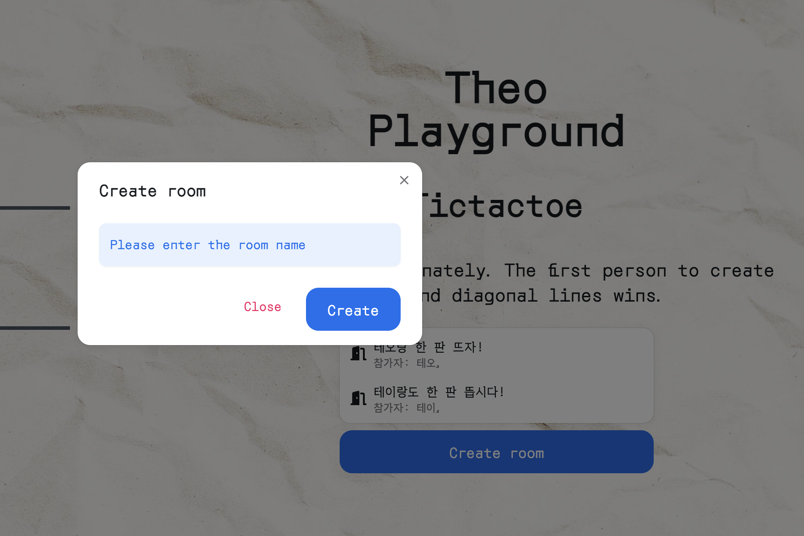

# 테오 플레이그라운드

Javascript로 구현 가능한 게임들을 만들어서 미니게임 모음집

## 진행 상황

멘탈 털려서 머리 식힐 겸 디자인 작업

**우선 작업 필요 내용**
redux에 대한 이해 없이 붙였더니 오히려 웹소켓을 통해 데이터를 주고 받는 것이 더 힘들어졌다. 이 부분부터 바로 잡아야 할 듯

## TODO

-   공통 레이아웃 작업
-   가장 쉬운 틱택토 먼저 작업
    -   승패 여부 확인 함수 리팩토링
    -   키보드 조작 지원
-   실시간 멀티플레이 기능 구현
-   redux 관련 작업
